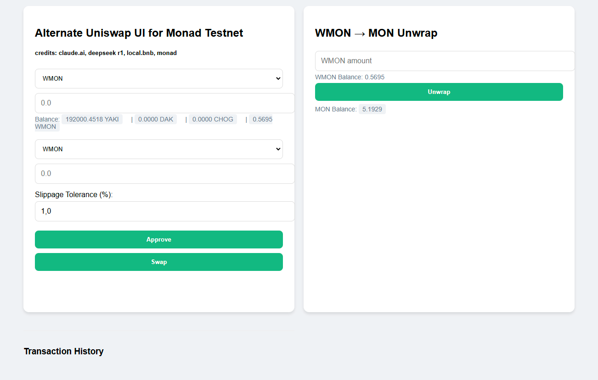

# MonadSwap Interface 🚀

Alternative Uniswap UI for Monad Testnet with native MON token support. Created due to the current Uniswap interface not working.

 <!-- Add actual screenshot later -->

## Features ✨

- 🔄 Token swapping between major testnet assets (YAKI, DAK, CHOG, WMON)
- 🔓 WMON/MON wrapping/unwrapping
- 📊 Real-time price estimates with slippage tolerance (1-50%)
- 💼 MetaMask/EVM-wallets integration with automatic network detection
- 📜 Transaction history with explorer links
- 🏦 Balance tracking for all supported tokens

## Supported Tokens 💰

| Token | Contract Address |
|-------|----------------------------------------------|
| WMON  | `0x760AfE86e5de5fa0Ee542fc7B7B713e1c5425701` |
| YAKI  | `0xfe140e1dCe99Be9F4F15d657CD9b7BF622270C50` |
| DAK   | `0x0f0bdebf0f83cd1ee3974779bcb7315f9808c714` |
| CHOG  | `0xe0590015a873bf326bd645c3e1266d4db41c4e6b` |

## Tech Stack 🛠️

- **Frontend**: Vanilla HTML/CSS/JS
- **Ethereum Interaction**: ethers.js v5.7
- **Smart Contracts**: Uniswap V2
- **Network**: Monad Testnet (Chain ID 10143)

## Live Demo

You can access a live demo of the application at [unimonad.netlify.app](https://unimonad.netlify.app/).

## Usage

1. Connect your MetaMask/EVM wallet to the Monad Testnet. (Rabby should automatically connect to the Monad Testnet).
2. Select the tokens you wish to swap.
3. Enter the amount you want to swap.
4. Click the Approve button to allow the contract to spend your tokens.
5. Click the Swap button to execute the token swap.
6. For unwrapping WMON, enter the amount and click Unwrap.

## Configuration

The project contains a configuration object where you can specify:

- Router Address: The address of the router contract for token swapping.
- Factory Address: The address of the factory contract.
- Token Addresses: The addresses for each token used in the application.
- Chain ID: The ID for the Monad Testnet.

You can adjust these settings in the script section of the HTML file.

## Contributing

Contributions are welcome! If you have suggestions for improvements or new features, feel free to open an issue or submit a pull request.

## License

This project is licensed under the MIT License.

## Acknowledgements

- Special thanks to **Uniswap**, **Monad**, **Anthropic**, **DeepSeek**. 
